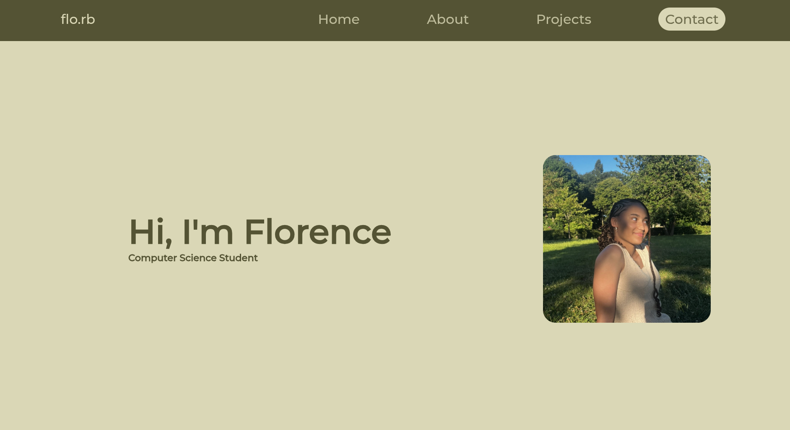

# Mon Portfolio
Bienvenue sur mon portfolio personnel. 

# Le site
Voici le lien direct vers le portfolio : [Le site](https://flo-rb.github.io/my-portfolio/)

# A propos
J'ai crée ce projet pour présenter de manière concise, qui je suis, mes compétences et les projets sur lesquels j'ai travaillé en tant qu'étudiante en informatique. Il a été crée de zéro en **HTML** et **CSS** : j'ai voulu créer un design esthétique et épuré.

# Aperçu

